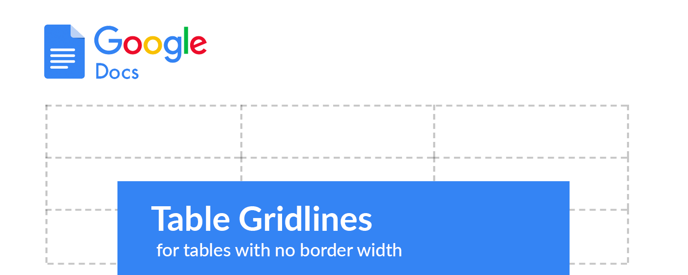

### View invisible table outlines as gridlines

Similar to the "View gridlines" functionality in Microsoft Word, this extension allows you to view faint dashed borders on invisible tables (i.e. tables with border of width 0). Those gridlines will not be printed and visible to others, and can be deactivated via a toggle in the extension's menu in the Chrome menu.

[Install extension from Chrome Web Store]()

